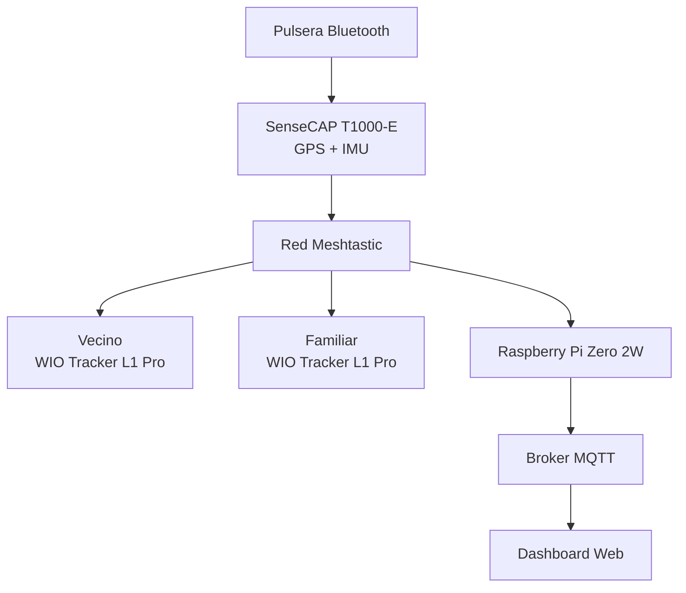
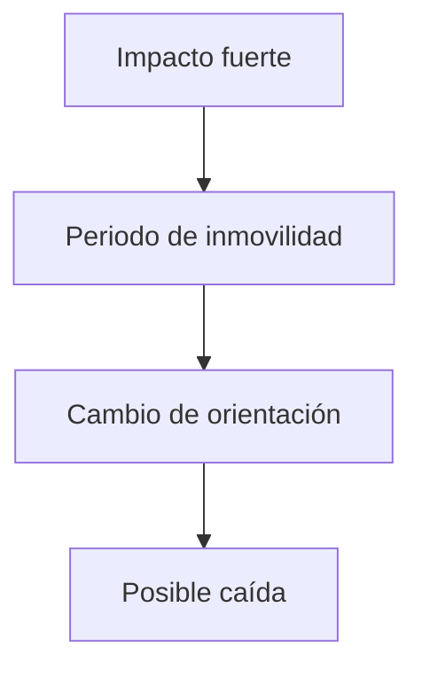
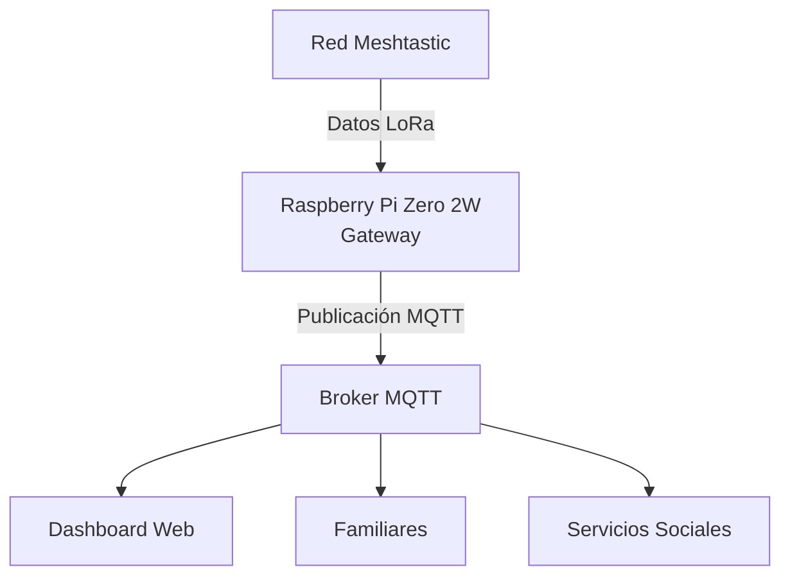

# Diseño e implementación de un sistema wearable para la detección de situaciones de riesgo en personas mayores en entornos rurales con conectividad limitada

Otros títulos alternativos:

- Diseño de una solución IoT basada en LoRa Mesh para la teleasistencia de personas mayores en zonas rurales.
- Sistema wearable para monitorización de personas mayores en ámbito rural tecnologías IoT de bajo consumo.
- Plataforma IoT para detección de caídas y monitorización de personas mayores en entornos rurales mediante redes LoRa Mesh.

## Capítulo 1. Introducción

### 1.1 Contexto y motivación: despoblación rural y envejecimiento

- Envejecimiento de la población.
- Personas mayores que viven solas.
- Riesgo de caídas y problemas cardiovasculares.
- Problemas de conectividad en zonas rurales.

### 1.2 Problema

¿Cómo diseñar un sistema wearable capaz de detectar situaciones de riesgo y comunicar alertas en zonas con escasa cobertura móvil?

### 1.3 Objetivos

#### Objetivo general

Diseñar e implementar un sistema wearable basado en una red LoRa Mesh para la detección y comunicación de situaciones de riesgo en personas mayores residentes en entornos rurales.

#### Objetivos específicos

- Integrar monitorización de frecuencia cardíaca mediante Bluetooth.
- Obtener ubicación GPS en tiempo real.
- Detectar caídas mediante sensores inerciales.
- Definir zonas seguras (geofencing).
- Transmitir alertas mediante Meshtastic.
- Diseñar un gateway IoT basado en Raspberry Pi.
- Publicar datos mediante MQTT.
- Visualizar información en un dashboard.
- Evaluar cobertura, autonomía y fiabilidad.

### 1.4 Metodología

- Diseño.
- Implementación.
- Validación experimental.

### 1.5 Estructura del documento

...

## Capítulo 2. Estado del arte

### 2.1 Envejecimiento y teleasistencia

- Teleasistencia tradicional.
- Teleasistencia avanzada.

### 2.2 Wearables para monitorización de personas mayores

- Smartwatches.
- Pulseras médicas.
- Sistemas anti-caída.

### 2.3 Redes LPWAN

- Sigfox.
- NB-IoT.
- LTE-M.
- LoRaWAN.
- Redes Mesh.

### 2.4  Meshtastic

- Alternativas LoRa Mesh y pequeña comparativa (Indicar las tecnologias evaluadas como MeshCore y Reticulum)
- Arquitectura.
- Protocolos.
- Ventajas en entornos rurales.

### 2.6 Trabajos relacionados???

....

## Capítulo 3. Diseño de la solución

### 3.1 Arquitectura general

Sería interesante incluir un diagrama como:

### 3.2 Requisitos funcionales

- Monitorización cardíaca.
- Detección de caídas.
- Geolocalización.
- Geofencing (¿trabajo futuro?)
- Generación de alertas.
- Visualización remota.

### 3.3 Requisitos no funcionales

- Bajo consumo.
- Fiabilidad.
- Cobertura.
- Escalabilidad.
- Coste reducido.

## Capítulo 4. Hardware empleado

### 4.1 Nodo wearable

- SenseCAP T1000-E

### 4.2 Sensor cardíaco

- Brazalete Bluetooth

### 4.3 Nodo receptor

- Wio Tracker L1 Pro

## 4.4 Gateway

- Raspberry Pi Zero 2 W
- Hat LoRa

## Capítulo 5. Desarrollo e implementación

### 5.1 Configuración de Meshtastic

...

### 5.2 Integración Bluetooth

...

### 5.3 Detección de caídas

- Utilizando acelerómetro e IMU.
- Algoritmo (local o en gateway):

### 5.4 Geofencing (opcional)

- Definición de zona segura.
- Generación de alarma cuando ubicación fuera de zona segura (algoritmo local o remoto)

### 5.5 Gestión de alertas

- Pulso elevado o muy bajo.
- Salida de zona segura.
- Caída detectada.

### 5.6 Gateway MQTT

Flujo:

### 5.7 Dashboard

- Justificar la plataforma escogida.
- Visualización:
	- Mapa.
	- Estado actual.
	- Histórico.
	- Alertas.

### 5.8 Dificultades encontrados / Problemas y soluciones

- Dificultad con el nodo WIO Tracker L1
- Problemas con el acelerometro QMA6100P
- ...

## Capítulo 6. Validación experimental y resultados

### 6.1 Escenarios de prueba??

- Interior vivienda.
- Núcleo urbano rural.
- Campo abierto.
- Zona sin cobertura móvil.

### 6.2 Métricas??

- Cobertura
- Latencia
- Consumo/autonomía
- Fiabilidad

### 6.3 Pruebas funciónales de detección

- Caídas simuladas.
- Caminatas normales.
- Salida de zona segura (*fence*).
- Simulación de situacion de pulso anómalo.

### 6.4 Resultados

- Alcance de la red.
- Autonomía del wearable.
- Precisión GPS.
- Precisión detección de caídas.
- Tasa de falsas alarmas.
- Tiempo medio de notificación.

## Capítulo 7. Conclusiones y trabajo futuro

### 7.1 Conclusiones

- Viabilidad técnica.
- Beneficios para entornos rurales.
- Limitaciones detectadas.

### 7.2 Trabajo futuro

Lo que no de tiempo e ideas más tipo brainstorming como:

- IA para detección de patrones de riesgo.
- Aplicación móvil específica.
- Uso de  nodos repetidores con paneles solares.
- Integración con plataformas Smart Village.
